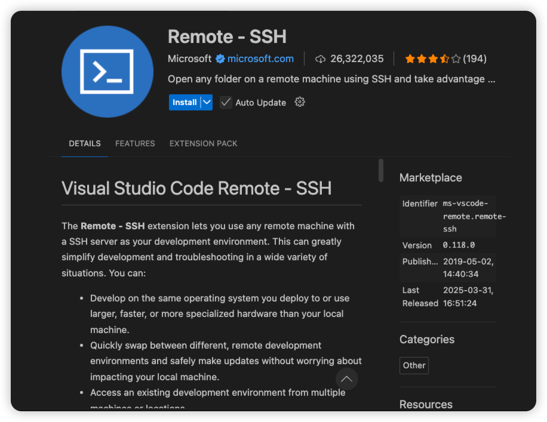
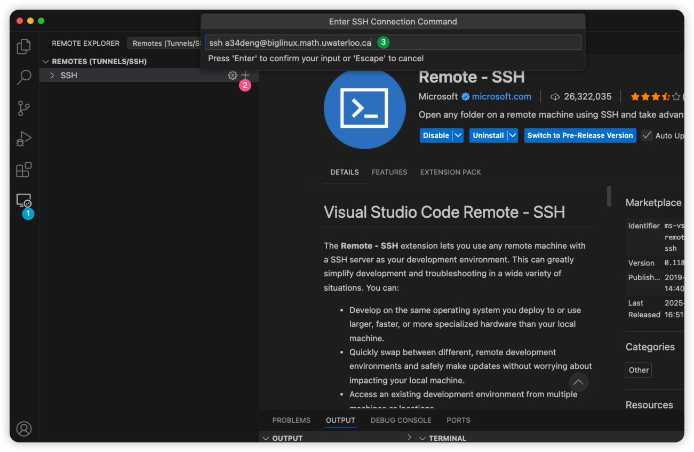
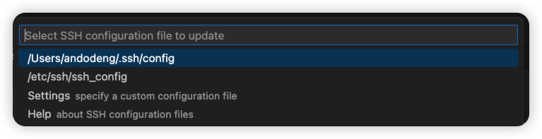

# MindReadingAutobot


### BigLinux Cluster SetUp

#### 1. Background
We will need the power of the biglinux cluster of MFCF to run our hyperparameter tuning experiments, the current code is written for biglinux. Doing this on a personal laptop will be very slow and not considered to be feasible. The easiest way is to use a code editor like VSCode to connect to the cluster, and write code, execute code and launch jobs just like on your local machine. 

#### 2. VPN
If you are working off-campus, you will need to connect with a VPN, the setup instruction is [here](https://uwaterloo.atlassian.net/wiki/spaces/ISTSERV/pages/42588307544/About+the+Virtual+Private+Network+VPN)

#### 3. VSCode Setup

- Install the extension Remote - SSH on VSCode

- Once installed, you will see an icon at the leftmost menu bar, click this icon, then click the + button, you will see a search bar at the top

Enter your UWaterloo credentials to sign in:
  ```
  ssh your-username@biglinux.math.uwaterloo.ca 
  ```

- VSCode will ask you where you want to save this SSH configuration, it does not matter in general, just choose anyone
 
- Now you should see biglinux has been added, click the right arrow button to connect, you will need to enter the password. 


#### 4. Optional: Configure SSH keys for remote connection  
If you do not want to enter the password each time you log in, you can go with a SSH key-based authentication.
- Generate an SSH Key
  ```
  ssh-keygen -t ed25519 -C "your_email@example.com"
  ``` 
- Copy the public key to the server: 
  ```
  ssh-copy-id username@your.server.ip
  ```
- Now try:
  ```
  ssh username@your.server.ip
  ``` 
  If you see you log in to the server without a password, the setup is correct. 

### Installation
The repo we are using is under Devin's GitHub account, you will need Devin to invite you to this repo. Clone this repo to a place on biglinux. 

We use Conda for package management, you will first need to build a conda environment to run the code:

- Look at autobots.yml file in this directory, for the last line, replace it with your own username 

- Build a conda environment with the autobots.yml file

  ```
  conda env create -f autobots.yaml
  ```
  This will create a conda environment called **autobots** with the packages specified in the file. It will take a while as there are a lot of dependencies. 

- Once the above is done, activate the environment:

  ```
  conda activate autobots
  ```

  Then do a editable install of our own code
  ```
  cd mindautoreadingbots
  pip install -e .
  ```
  
Now the environment is ready, you should be able to generate datasets, launch jobs, and analyze results. 


### Pipeline 
There are mainly three things to know for this codebase, dataset generation, hyperparameter tuning and results analysis. In this section, I assume you are inside the directory of the topmost **MindReadingAutobot**, all directories mentioned below will be relative to this. 

1. Dataset Generation 
In **mindreadingautobots/data/make_datasets.ipynb**, it contains some code to generate data. The code for data generation is mainly in **mindreadingautobots/src/mindreadingautobots/sequence_generators/make_datasets.py**. When you generate data, it will create a folder for 


